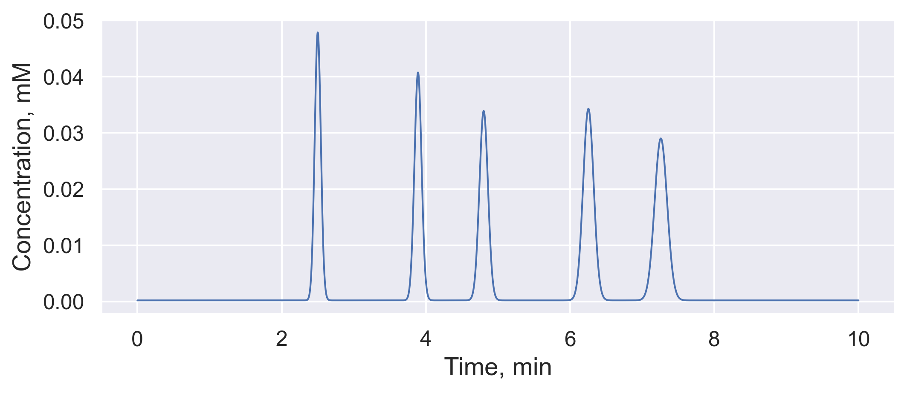

# PyICLab

PyICLab is an open-source Python package designed for in-silico simulations of ion chromatography (IC). It features an object-oriented programming (OOP) interface, providing robust tools for realistic and customized simulations.

## Features

- Implementations of IC components
- Built-in numerical models
- Flow path management
- Suitable for complex IC setups and conditions

## Installation

PyICLab can be installed via PyPI using pip. Ensure you have Python 3.11 or higher.

For Windows:
```sh
pip install pyiclab
```
For MacOS:
```sh
pip3 install pyiclab
```
### Note for Apple Silicon Users

PyICLab currently DOES NOT support the ARM64 architecture directly. To use PyICLab on Apple Silicon, you are advised to build your Python3 environment using **an x86 version** of conda/miniconda. 

## Dependencies

PyICLab requires the following Python packages:

- `numpy>=1.26.4`
- `scipy>=1.12.0`
- `pandas>=2.2.0`
- `pint>=0.23`
- `matplotlib>=3.8.2`
- `seaborn>=0.13.2`
- `phreeqpython>=1.5.0`
- `pyEQL>=0.12.2`
- `beautifulsoup4>=4.12.3`
- `tqdm>=4.66.2`
- `quadprog`
- `deprecated`

## Get Started

Here is a simple example to demonstrate the basic usage of PyICLab:

```python
from pyIClab._testing_toolkit import PackedIC
from pyIClab.beadedbag import mpl_custom_rcconfig
import seaborn as sns
import matplotlib.pyplot as plt

ic = PackedIC()
ic.go(tmax='10 min')

detector = ic.detectors.pop()
df = detector.get_signals()

sns.set()
plt.rcParams.update(mpl_custom_rcconfig)
fig, ax = plt.subplots()
ax.plot('time', 'signal', data=df)
ax.set_xlabel('Time, min')
ax.set_ylabel('Concentration, mM')
plt.show()
```


## Or you can build your IC system step by step:
Import the necessary components from the PyICLab package.
```python
from pyIClab import (
    IonChromatograph, Eluent, SwitchingValve,
    SampleLoop, Dummy, QuickSuppressor, Detector,
    )
```
Create the necessary accessories for a basic IC system. Ensure each accessory has a unique name. This includes:
- An IC pump (Eluent)
- A six-port valve
- A 25-µL sample loop
```python
eluent = Eluent.HydroxideIsocratic('18 mM') # Name defaults to 'KOH'
valve = SwitchingValve.SixPort() # Name defaults to 'SixPort'
loop = SampleLoop('Loop', V='25 uL')
```

Use a built-in column initializer with a primitive stationary phase database
```python
column = Dummy.Column() # Name defaults to 'Dummy'
```

PyICLab provides several suppressor implementations. Here is the simplest one. Visit `pyIClab.assemblies.signals` for more options. Also, add a detector to the system.

```python
suppressor = QuickSuppressor('Suppressor', kind='anion')
detector = Detector('Detector')
```

Connect all the accessories and install the IC system. I bet you have done it a lot.
```python
valve.assemble(0, eluent)
valve.assemble(1, column)
valve.assemble([2, 5], loop)
column.assemble(suppressor)
suppressor.assemble(detector)
```

Now we can build a basic IC system. Setting `lockon=valve` means that when accessing the IC system, PyICLab will find all the accessories by starting with the valve. All accessories traced back to the valve will be included in the IC system.
```python
ic = IonChromatograph('SimpleIC', competing_ions=('OH-',), lockon=valve)
```

Prepare a simple solution and inject it into the loop.

```python
solution = {
    'F-': '0.05 mM',
    'Cl-': '0.075 mM',
    'NO2-': '0.09 mM',
    'Br-': '0.1 mM',
    'NO3-': '0.125 mM',
    'SO4-2': '0.15 mM',
}
ic.inject(solution, 'Loop')
```

Set a model constructor for the sole column in the IC system. PyICLab provides built-in model constructors that allow you to configure model parameters in one code line. Use `help(pyIClab.interface.DSMConstrutorForColumns)` for more information.

```python
ic.set_ModelConstructor('DSM_SEConstrutor', 'Dummy')
```

Set commands for the IC system as if it were real. You can also use `.add_command()` to add commands one by one.

```python
commands = '''
    0.0 min, sixport, inject
    0.5 min, sixport, load
'''
ic.reset_commands(commands)
```

Think we are all set. Let's go.
```python
ic.go('12 min')
```

Use the `.plot` method to show the effluent composition.

```python
detector.plot()
```

